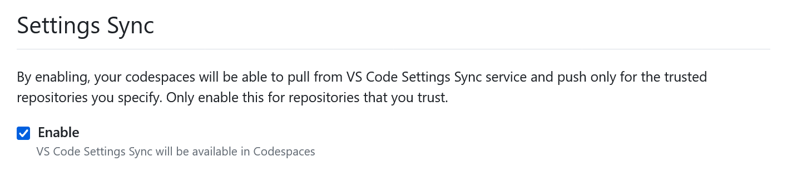

= 🔒 Tools

This is a repository of binaries and configurations for some of my development tools. This repository is maintained to facilitate the backing up and restoration of my local development environment configuration, and to ease the synchronization and porting of my dev tools between different computers. This repository includes the following:

- Terminal customization using [Oh-My-Posh](https://ohmyposh.dev/)
- VS Code user-level settings, including theme and keybindings
- Windows Terminal configuration
- Binaries for command line utilities like [lazygit](https://github.com/jesseduffield/lazygit)

These configurations extend from my https://github.com/kieranpotts/dotfiles[dotfiles], which MUST be installed first on new machines.

== Documentation

=== Requirements

This repository encapsulates configuration for the following tools. All are OPTIONAL.

- https://github.com/dandavison/delta[Delta] (less-based pager with syntax highlighting)
- https://git-scm.com/[Git]
- https://github.com/jesseduffield/lazygit[LazyGit]
- https://ohmyposh.dev/[Oh-My-Posh]
- https://code.visualstudio.com/[Visual Studio Code]
- https://github.com/microsoft/terminal[Windows Terminal]
- https://www.sublimemerge.com/[Sublime Merge]

Windows binaries are bundled for `delta`, `lazygit` and `oh-my-posh`. To use these programs from the command line, add this repository's `bin` directory to your system's `PATH` environment variable. Other required programs should be installed manually.

=== Installation

==== 1. Install the fonts

The configurations for VSCode and Windows Terminal depend on the following fonts being installed locally:

* Hack
* Hack Nerd Font

Hack is a programming font. It adds special ligatures that merge multiple consecutive characters into a single composite glyph, for example `>=` is presented as `≥` and `!=` as `≠`, improving readability without changing the code. Hack NF (Nerd Font) is a version of the same font extended with additional glyphs that are used to create visual design effects like icons and rounded corners in a shell's prompt line.

Both these fonts are included in the `./vendor/fonts` directory and need to be installed manually. The Hack Nerd Font is the Windows-compatible version.

==== 2. Add the `bin` directory to your system PATH environment variable

This repository's `bin` directory contains various executable programs including `oh-my-posh` and `lazygit` binaries (for Windows only). It is RECOMMENDED you add the `bin` directory to your system PATH environment variable, which will make these programs available from the command line.

==== 3. Create symlinks to the configuration files

Configuration files are included for various development tools, including Visual Studio Code and Windows Terminal, for easy portability between machines. You will need to create symlinks to enable these configurations. Run Windows Powershell in administrator mode and execute the following commands, changing the filesystem paths as required:

[source,powershell]
----
New-Item -ItemType SymbolicLink -Path "C:\Users\[User]\AppData\Local\Packages\Microsoft.WindowsTerminal_[hash]\LocalState\settings.json" -Target "C:\path\to\tools\etc\wt\settings.json" -Force

New-Item -ItemType SymbolicLink -Path "C:\Users\[User]\AppData\Roaming\Code\User\settings.json" -Target "C:\path\to\tools\etc\vscode\settings.json" -Force

New-Item -ItemType SymbolicLink -Path "C:\Users\[User]\AppData\Roaming\Code\User\keybindings.json" -Target "C:\path\to\tools\etc\vscode\keybindings.json" -Force

New-Item -ItemType SymbolicLink -Path "C:\Users\[User]\AppData\Roaming\Code\User\snippets\global.code-snippets" -Target "C:\path\to\tools\etc\vscode\global.code-snippets" -Force

New-Item -ItemType SymbolicLink -Path "C:\Users\[User]\AppData\Roaming\lazygit\config.yml" -Target "C:\path\to\tools\etc\lazygit\config.yml" -Force

New-Item -ItemType SymbolicLink -Path "C:\Users\[User]\AppData\Roaming\Sublime Merge\Packages\User\Preferences.sublime-settings" -Target "C:\path\to\tools\etc\sublime-merge\Preferences.sublime-settings" -Force
----

////
TODO: Edit config for Sublime Merge
TODO: Edit config for Sublime Text
////

////
TODO: Add equivalent documentation for Unix-like systems.
////

==== 4. Enable the shell theme

The process for enabling the custom Oh-My-Posh theme is different. First, create a link to the `etc/oh-my-posh` directory from `~/oh-my-posh` in the home directory of your system user. On Windows, use Powershell running with administrator privileges.

[source,sh]
----
ln -s path/to/etc/oh-my-posh ~/oh-my-posh
----

[source,powershell]
----
New-Item -ItemType SymbolicLink -Path "C:\Users\[User]\oh-my-posh" -Target "C:\path\to\tools\etc\oh-my-posh" -Force
----

Add the following to your `.bash_profile` (use the `local.bash_profile` installed from the dotfiles):

[source,sh]
----
# Start Oh My Posh and load your preferred prompt theme.
#
# Errors are redirected to standard error because `oh-my-posh` is an optional
# dependency, so we don't want to assume it is installed.
#
# Documentation:
# https://ohmyposh.dev/
#
eval "$(oh-my-posh init bash --config ~/oh-my-posh/themes/hacks.omp.json 2> /dev/null)"
----

The Hacks theme is a custom fork of the popular Agnoster theme, which is included with Oh-My-Posh. You can change the `--config` parameter to load different themes for your shell's prompt line. More themes can be installed by running the commands below.

[source,sh]
----
mkdir [path/to/install/dir]
cd [path/to/install/dir]
wget https://github.com/JanDeDobbeleer/oh-my-posh/releases/latest/download/themes.zip -O themes.zip
unzip themes.zip
chmod u+rw *.json
rm themes.zip
----

NOTE: `wget` is not pre-installed in the Git Bash emulator. Download the https://eternallybored.org/misc/wget/[binary from here]

Oh My Posh is highly customizable. See https://ohmyposh.dev/docs/[the website] for more options. As a cross-platform framework, configurations can be shared between shells. So you can expose your Powershell, Git Bash and WSL environments to the same configuration, ensuring a consistent prompt in every shell environment running in every terminal program.

==== 5. GitHub Codespaces configuration (optional step)

Go to your https://github.com/settings/codespaces[GitHub Codespaces options] and enable the following setting. This will use your VS Code Settings in GitHub Codespaces.

=== Updating

This repository includes Windows binaries for the following utilities:

* `delta` (a pager with syntax highlighting)
* `lazygit` (Git client)
* `oh-my-posh` (terminal customization framework)

Fresh binaries can be downloaded from the following links:

* https://github.com/dandavison/delta/releases
* https://github.com/jesseduffield/lazygit/releases
* https://github.com/JanDeDobbeleer/oh-my-posh/releases

////
TODO: Add docs for configuring WSL.
TODO: Add docs for configuring PowerShell, eg to use same Oh-My-Posh config
////

''''

Copyright © 2020-2023 Kieran Potts – All rights reserved

The executable binaries redistributed via this repository are copyright their respective authors and may be subject to alternative free and open source software licenses.
