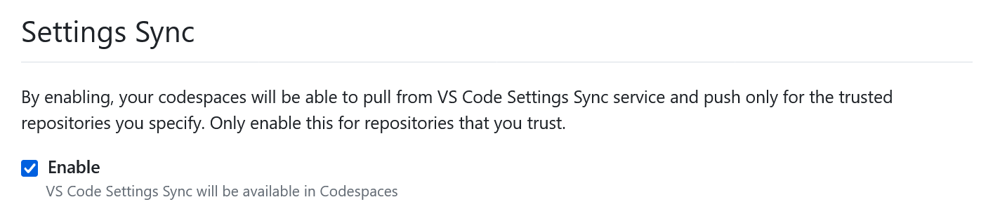

# Installation

To install these devtools on a new machine, first clone the repository to the host machine.

```
git clone git@github.com:<user_or_org>/devtools.git
```

If using Windows with WSL2, the devtools may need to be cloned in two places – directly on the host (Windows) and also the guest OS (WSL2) – depending on which tools you're using and where.

Then follow the steps below to set up everything.

## Install the fonts.

Some devtools configurations depend on the following fonts being installed locally:

- Hack + Hack NF
- Maple Mono + Maple Mono NF (nerd font)

TrueType files for these fonts are included in the `./vendor/fonts` directory. These need to be installed manually. In Ubuntu-based Linux distributions, you can simply copy them into `~/.local/share/fonts`. If this directory does not yet exist, you can create it.

Hack and Maple Mono are programming fonts. They add special ligatures that merge multiple consecutive characters into a single composite glyph, for example `>=` is presented as `≥` and `!=` as `≠`, improving readability. The Nerd Font versions are extended with additional glyphs that are used to create visual effects like icons and rounded corners in a shell's prompt line.

## Create symlinks to the configuration files.

**Linux**

Run the install script from the repository root:

```
./run/install
```

This installs symlinks to this repository's devtools configurations, from the locations that each devtool expects to find them.

The installer will back up any existing configuration files before replacing them with symlinks into this repository.

**Windows**

Run Windows Powershell in administrator mode and execute the following commands, changing the filesystem paths as required.

NOTE: Configurations for CLI tools like LazyGit, Neovim, and tmux MUST be installed in the Windows host to use those tools from emulators like MySysGit / Git Bash.

```powershell
#
# Docker Desktop
#

Move-Item `
  -Path "C:\path\to\devtools\etc\docker\desktop\settings-store.json" `
  -Destination "$env:APPDATA\Docker\settings-store.json" `
  -Force

#
# LazyGit
#

New-Item -ItemType SymbolicLink `
  -Path "C:\Users\[User]\AppData\Roaming\lazygit\config.yml" `
  -Target "C:\path\to\dotfiles\etc\lazygit\config.yml" `
  -Force

#
# Neovim
#

New-Item -ItemType SymbolicLink `
  -Path "C:\Users\[User]\AppData\Local\nvim\init.vim" `
  -Target "C:\path\to\dotfiles\etc\nvim\init.vim" `
  -Force

#
# Sublime Merge
#

New-Item -ItemType SymbolicLink `
  -Path "C:\Users\[User]\AppData\Roaming\Sublime Merge\Packages\User\Preferences.sublime-settings" `
  -Target "C:\path\to\devtools\etc\sublime-merge\Preferences.sublime-settings" `
  -Force

#
# tmux
#

New-Item -ItemType SymbolicLink `
  -Path "C:\Users\[User]\.tmux.conf" `
  -Target "C:\path\to\dotfiles\etc\tmux\tmux.conf" `
  -Force
New-Item -ItemType SymbolicLink `
  -Path "C:\Users\[User]\.tmux\dev" `
  -Target "C:\path\to\dotfiles\etc\tmux\inc\dev" `
  -Force

#
# VS Code / VS Codium
#

New-Item -ItemType SymbolicLink `
  -Path "C:\Users\[User]\AppData\Roaming\[Code|VSCodium]\User\settings.json" `
  -Target "C:\path\to\devtools\etc\vscode\settings.json" `
  -Force

New-Item -ItemType SymbolicLink `
  -Path "C:\Users\[User]\AppData\Roaming\[Code|VSCodium]\User\keybindings.json" `
  -Target "C:\path\to\devtools\etc\vscode\keybindings.json" `
  -Force

New-Item -ItemType SymbolicLink `
  -Path "C:\Users\[User]\AppData\Roaming\[Code|VSCodium]\User\chatLanguageModels.json" `
  -Target "C:\path\to\devtools\etc\vscode\chatLanguageModels.json" `
  -Force

New-Item -ItemType SymbolicLink `
  -Path "C:\Users\[User]\AppData\Roaming\[Code|VSCodium]\User\snippets\global.code-snippets" `
  -Target "C:\path\to\devtools\etc\vscode\global.code-snippets" `
  -Force

#
# Windows Terminal
#

New-Item -ItemType SymbolicLink `
  -Path "C:\Users\[User]\AppData\Local\Packages\Microsoft.WindowsTerminal_[hash]\LocalState\settings.json" `
  -Target "C:\path\to\devtools\etc\wt\settings.json" `
  -Force

#
# WSL
#

New-Item -ItemType SymbolicLink `
  -Path "C:\Users\[User]\.wslconfig" `
  -Target "C:\path\to\devtools\etc\wsl\.wslconfig" `
  -Force
```

## Add the `bin` directory to your PATH environment variable.

**Windows only.**

Windows binaries for various Unix programs are bundled in the `bin` directory of this repository.

These programs can be installed on your Windows machine simply by adding this repository's `bin` directory to your system's `PATH` environment variable. This will make the programs available to emulators like Git Bash for Windows.

Native binaries should be installed in WSL in the normal way.

## Sync VS Code settings with GitHub Codespaces.

Optionally, you can use GitHub Settings Sync to have a consistent user experience between cloud and local instances of VS Code. There are two steps to follow:

1. Login to VS Code using your GitHub account, and enable Settings Sync in your VS Code user settings.

2. Go to your [GitHub Codespaces options](https://github.com/settings/codespaces) and enable the Settings Sync opion there, too:


