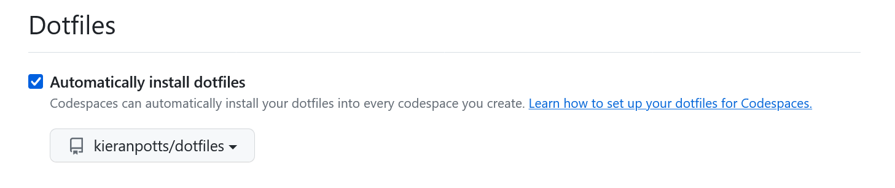
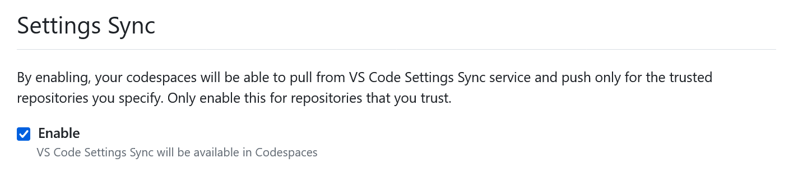

= Installation

Follow these steps to install the devtools on a new computer for the first time. After installing, follow the instructions for link:./configuration.adoc[configuring] and link:./updating.adoc[updating] the devtools.

First, fork this repository to your own GitHub account, then clone your fork to your local machine. You should clone the repository directly into your user home directory.

[source,sh]
----
git clone git@github.com:[user_or_org]/devtools.git
----

Alternatively, after cloning the repository elsewhere, create a link to it from `~/devtools`. For WSL, run the terminal program with administrator privileges.

[source,sh]
----
ln -s /path/to/devtools ~/devtools
----

On Windows, use Powershell running with Administrator privileges.

[source,powershell]
----
New-Item -ItemType SymbolicLink -Path "C:\Users\[Username]\devtools" -Target "C:\path\to\devtools" -Force
----

== Dotfiles installation

=== 1. Run the `update!` script

Change to the root directory of the cloned repository and run the `bin/posix/update!` shell script. If your OS is Windows, your terminal program MUST be run with administrator privileges in order for the script to be able to create the necessary symlinks.

[source,sh]
----
cd ~/devtools
sh bin/posix/update!
----

The update script will install and enable the dotfiles. The first time you do this, you will need to exit your terminal program then restart it. Doing so will create a new login shell, which will load the newly-installed dotfiles at startup.

=== 2. Add the `bin/*` directories to your system PATH environment variable

This repository's `bin/posix` directory contains various `git-*` shell scripts that are mapped to Git aliases. It is RECOMMENDED you add the `bin/posix` directory to your system PATH environment variable, to make these Git commands available from the command line on all Unix-like systems (including Git Bash for Windows).

For Unix shells, the `local.bash_profile` file already includes a script to add `~/devtools/bin/posix` to the `PATH` environment variable.

On Windows, also adding `~/devtools/bin/windows` to your system PATH will also make available the bundled Windows binaries for Delta, LazyGit, Oh-My-Posh and other tools, so you won't need to manually install these programs.

== Program configurations

=== 1. Install the fonts

The configurations for VS Code and Windows Terminal depend on the following fonts being installed locally:

* Hack
* Hack Nerd Font

Hack is a programming font. It adds special ligatures that merge multiple consecutive characters into a single composite glyph, for example `>=` is presented as `≥` and `!=` as `≠`, improving readability without changing the code. Hack NF (Nerd Font) is a version of the same font extended with additional glyphs that are used to create visual design effects like icons and rounded corners in a shell's prompt line.

TrueType formats of both fonts are included in the `./vendor/fonts` directory and need to be installed manually.

=== 2. Create symlinks to the configuration files

Configuration files are included for various development tools, including VS Code and Windows Terminal, for easy portability between machines.

To use these configuration, you will need to create symlinks to them. On Windows, run Windows Powershell in administrator mode and execute the following commands, changing the filesystem paths as required.

.Windows
[source,powershell]
----
# LazyGit
New-Item -ItemType SymbolicLink -Path "C:\Users\[User]\AppData\Roaming\lazygit\config.yml" -Target "C:\path\to\devtools\etc\lazygit\config.yml" -Force

# Sublime Merge
New-Item -ItemType SymbolicLink -Path "C:\Users\[User]\AppData\Roaming\Sublime Merge\Packages\User\Preferences.sublime-settings" -Target "C:\path\to\devtools\etc\sublime-merge\Preferences.sublime-settings" -Force

# VS Code / VS Codium
New-Item -ItemType SymbolicLink -Path "C:\Users\[User]\AppData\Roaming\[Code|VSCodium]\User\settings.json" -Target "C:\path\to\devtools\etc\vscode\settings.json" -Force
New-Item -ItemType SymbolicLink -Path "C:\Users\[User]\AppData\Roaming\[Code|VSCodium]\User\keybindings.json" -Target "C:\path\to\devtools\etc\vscode\keybindings.json" -Force
New-Item -ItemType SymbolicLink -Path "C:\Users\[User]\AppData\Roaming\[Code|VSCodium]\User\snippets\global.code-snippets" -Target "C:\path\to\devtools\etc\vscode\global.code-snippets" -Force

# Windows Terminal
New-Item -ItemType SymbolicLink -Path "C:\Users\[User]\AppData\Local\Packages\Microsoft.WindowsTerminal_[hash]\LocalState\settings.json" -Target "C:\path\to\devtools\etc\wt\settings.json" -Force

# Neovim
New-Item -ItemType SymbolicLink -Path "C:\Users\[User]\AppData\Local\nvim\init.vim" -Target "C:\path\to\devtools\etc\nvim\init.vim" -Force
----

.Unix-like systems
[source,sh]
----
# LazyGit
ln --symbolic --force /full/path/to/devtools/etc/lazygit/config.yml ~/.config/lazygit/config.yml

# VS Code / VS Codium
ln --symbolic --force /full/path/to/devtools/etc/vscode/settings.json ~/.config/Code/User/settings.json
ln --symbolic --force /full/path/to/devtools/etc/vscode/keybindings.json ~/.config/Code/User/keybindings.json
ln --symbolic --force /full/path/to/devtools/etc/vscode/global.code-snippets ~/.config/Code/User/snippets/global.code-snippets

# Nvim
mkdir -p ~/.config/nvim
ln --symbolic --force /full/path/to/devtools/etc/nvim/init.vim ~/.config/nvim/init.vim
----

=== 3. Enable the shell theme

A custom prompt theme is included. It is a fork of the popular Agnoster theme, which is included with Oh-My-Posh, a cross-platform prompt theming framework for Powershell, Git Bash, WSL and other shells.

The theme is enabled via the following command in the `~/local.bash_profile` file.

[source,sh]
----
eval "$(oh-my-posh init bash --config ~/devtools/etc/oh-my-posh/themes/kp2024.omp.json 2> /dev/null)"
----

Change the `--config` parameter to load different themes. More themes can be installed by running the commands below.

[source,sh]
----
mkdir [path/to/install/dir]
cd [path/to/install/dir]
wget https://github.com/JanDeDobbeleer/oh-my-posh/releases/latest/download/themes.zip -O themes.zip
unzip themes.zip
chmod u+rw *.json
rm themes.zip
----

NOTE: `wget` is not pre-installed in the Git Bash emulator. Download the https://eternallybored.org/misc/wget/[binary from here].

Oh My Posh is highly customizable. See https://ohmyposh.dev/docs/[the web site] for more options. As a cross-platform framework, configurations can be shared between shells. So you can expose your Powershell, Git Bash and WSL environments to the same configuration, ensuring a consistent prompt in every shell environment running in every terminal program.

////
TODO: Add docs for configuring PowerShell, eg to use same Oh-My-Posh config
////

== GitHub Codespaces configuration

////
Go to your https://github.com/settings/codespaces[GitHub Codespaces options] and enable the following setting. This will ensure your terminal environment in github.dev will be consistent with your local terminal.

////

Go to your https://github.com/settings/codespaces[GitHub Codespaces options] and enable the following setting. If you login to VS Code using your GitHub account, then this setting will ensure you VS Code settings are loaded into every virtual GitHub Codespace you create, ensuring a consistent user experience between cloud and local instances of VS Code.

